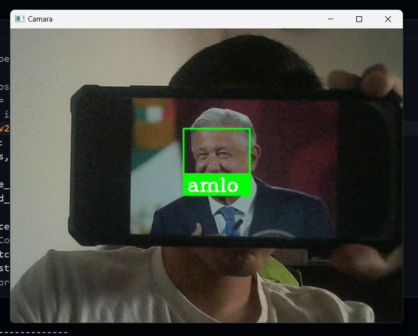

# Sistema de Reconocimiento Facial con OpenCV, face_recognition y dlib

Este proyecto es un sistema de reconocimiento facial que detecta e identifica rostros a partir de un conjunto de imágenes prealmacenadas utilizando una cámara web. Usa OpenCV para el procesamiento de imágenes, `face_recognition` y `dlib` para la codificación y comparación de rostros.



## Características

- Carga un conjunto de imágenes de personas desde una carpeta y las codifica para el reconocimiento facial.
- Detecta rostros en tiempo real desde la cámara web.
- Compara los rostros detectados con las imágenes almacenadas y muestra el nombre de la persona reconocida en el video.
- Se dibuja un rectángulo verde alrededor de los rostros detectados junto con el nombre correspondiente.
  
## Requisitos

- Python 3.x
- OpenCV (`opencv-python`)
- face_recognition
- dlib
- numpy
- pathlib
- cmake

Puedes instalar las bibliotecas necesarias con los siguientes comandos:

### Instalación de OpenCV, face_recognition y numpy:
```bash
pip install opencv-python face_recognition numpy pathlib
```
### Instalación de dlib y cmake
Para instalar `dlib`, primero necesitas instalar [cmake](https://cmake.org/download/) ya que `dlib` requiere compilar algunos archivos.

Luego instala `dlib` usando `pip`:
```bash
pip install dlib
```

## Uso
Coloca las imágenes de las personas en la carpeta `persons/`. El nombre del archivo (sin extensión) será el nombre de la persona.

Ejecuta el script:

    python main.py

Presiona `q` para salir.

## Funcionamiento
* El programa carga las imágenes del directorio persons/.
* Detecta rostros en tiempo real usando la cámara web.
* Compara los rostros detectados con las imágenes guardadas.
* Si hay una coincidencia, muestra el nombre en el video.
